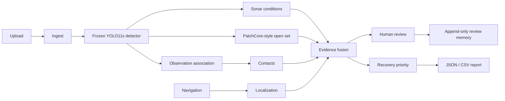

# 🌊 Aqualens

### The ocean is dark. The acoustic record isn't.

**AI-powered marine intelligence for side-scan sonar.**

Aqualens turns raw sonar surveys into reviewable, geolocated *when navigation is supplied*, marine **Contacts**. It combines object detection, temporal persistence, sonar-specific evidence where geometry permits, open-set anomaly evidence, and human review.

> Marine survey analysis with evidence and human review.

<p align="center"></p>

<p align="center">
  
  
  
</p>

| Start here | Go deeper |
|---|---|
| [The problem](#the-problem) · [One survey, one Contact](#one-survey-one-contact-heres-what-happens) · [Quickstart](#quickstart) | [Architecture](#architecture) · [Model truth](#current-model-truth) · [Scientific contract](docs/INTERNAL_HACK_FREEZE.md) |

## The problem

A side-scan sonar survey can contain thousands of acoustic frames. Somewhere inside may be abandoned fishing gear, pipelines, wrecks, cylinders, structural debris, or something unfamiliar.

But sonar is noisy. Acoustic shadows can resemble objects. Natural seabed structure creates false positives. One object can appear in neighbouring observations. GPS or navigation can arrive separately from imagery. And a closed-set detector cannot know every object it may encounter.

## What Aqualens does

```text
SONAR SURVEY
     ↓
DETECT → VERIFY → LINK ACROSS FRAMES → CHECK FOR UNKNOWN ANOMALIES
     ↓
LOCALIZE → HUMAN REVIEW → PRIORITIZE → REPORT
```

The result is not an unexplained box on an image. It is a Contact with source observations, evidence availability, provenance, and an analyst decision.

## One survey. One Contact. Here's what happens.

1. An operator uploads a sonar raster or prepared survey bundle.
2. Aqualens tiles and analyses the imagery locally.
3. The frozen detector proposes observations.
4. Neighbouring observations are associated into one operational Contact.
5. Persistence asks: did the candidate survive across available observations?
6. The open-set channel asks: is it unusual relative to reference seabed?
7. Navigation attaches coordinates only when the survey supplied them.
8. Available evidence is fused into an Evidence Score.
9. The analyst sees sonar, evidence, limits, and provenance together.
10. The analyst confirms, rejects, relabels, or marks uncertainty.
11. That review becomes append-only training memory, not instant retraining.
12. JSON or CSV exports the machine-readable operational record.

## 👀 But what if we've never trained on it?

YOLO can only assign one of its known labels. Aqualens therefore keeps a **separate open-set channel**: `PATCHCORE_STYLE_OPEN_SET`, memory version `open_set_v1`, using frozen YOLO11s layer-16 embeddings. Its threshold comes from `q99.5_annotation_safe_background_val`.

This produces an **unknown artificial candidate requiring review**, not a fourth YOLO class. A high open-set score means dissimilarity from the reference background memory. It is not a probability, proof of artificiality, or universal unknown-object recognition.

## Five reasons this is not a box-drawing demo

| | Differentiator | What it means in practice |
|---:|---|---|
| 01 | **Open-set anomaly detection** | Flags unusual artificial-looking candidates outside the supervised taxonomy for review. |
| 02 | **Temporal persistence** | Checks whether a candidate survives across neighbouring sonar observations. |
| 03 | **Acoustic evidence** | Uses sonar-specific physical evidence only where supplied metadata supports it. |
| 04 | **Survey-to-survey change** | Distinguishes `NEW`, `REMOVED`, `UNCHANGED`, `NOT_DETECTED`, and `NOT_SURVEYED`, and refuses unsupported comparisons. |
| 05 | **Recovery priority** | Transparent priority from available evidence, never a pretend learned ecological-risk model. |

Persistent review memory supports the architecture; it is deliberately not a sixth USP.

## YOLO sees a box. Aqualens asks whether the box deserves belief.

| Layer | Question |
|---|---|
| Detector | What does the frozen model propose? |
| Persistence | Does it survive across observations? |
| Sonar condition | Is this frame trustworthy enough to interpret? |
| Acoustic verification | Does available sonar physics support it? |
| Open-set | Is it unusual relative to reference seabed? |
| Navigation | Where was it actually observed? |
| Evidence fusion | What do the available channels collectively suggest? |
| Human review | What does the analyst decide? |
| Memory | What should a future curated training round remember? |

## Contacts, not boxes

An **observation** is one immutable detector output on one sonar frame. A **Contact** is the operational object associating one or more observations.

```text
Frame 041       Frame 042       Frame 043
   [box]           [box]           [box]
      \               |               /
       \              |              /
        └────── CONTACT CT-07 ──────┘
```

This is what lets an analyst inspect raw model output without mistaking three looks at the same thing for three separate recovery tasks. The runtime uses deterministic `SEQUENTIAL_PING` or `SINGLE_OBSERVATION` contact fusion, while keeping all raw observations inspectable.

## Architecture



The live stack is a **FastAPI** runtime and a **Next.js** workstation, running PyTorch local inference on Apple MPS where available. It serves a checksum-pinned frozen YOLO11s detector, PatchCore-style open-set memory, SQLite-backed survey state, and append-only review memory.

## Edge-first by design

The core analysis path has no heavy cloud dependency:

```text
Browser → local Next.js workstation → local FastAPI → PyTorch detector on Apple MPS → local runtime state
```

That is the deployment shape needed for a survey workstation: inspect locally, keep provenance close to the data, and make service health visible rather than hiding it behind a spinner.

## Current model truth

The frozen detector is **YOLO11s**, SHA-256 `2aa3ac71051856bcfc8ec400804995f03568aa26d1a1fb24583e4eb1b7a10b15`. Its runtime taxonomy is `PIPELINE`, `SHIPWRECK`, and `CRAB_POT`.

| Frozen held-out test | Precision | Recall | AP50 / mAP50 | mAP50-95 |
|---|---:|---:|---:|---:|
| Overall | 0.73445 | 0.32995 | 0.32239 | 0.11432 |
| PIPELINE | 0.67975 | 0.54917 | 0.52403 | 0.18025 |
| CRAB_POT | 0.52361 | 0.44067 | 0.42828 | 0.15846 |

`SHIPWRECK` has **recall 0** on this frozen held-out test and is **not production-qualified**. An explicitly marked presentation heuristic may assist its internal demo presentation, but raw detector output is preserved. We do not celebrate its precision because a class with zero recall is not operationally ready.

## Datasets, with provenance intact

| Dataset | What it contributes | Provenance |
|---|---|---|
| **SubPipe** | Pipeline side-scan sonar | Official Zenodo DOI [10.5281/zenodo.12666132](https://doi.org/10.5281/zenodo.12666132) |
| **AI4Shipwrecks** | 286 high-resolution SSS images, expert segmentation masks, 28 distinct wrecks | CC BY 4.0 · DOI [10.7302/dmf4-x492](https://doi.org/10.7302/dmf4-x492) |
| **PING / GhostVision** | 6,674 real SSS images; current downloaded target is Crab-Pot, recorded by consumer Humminbird sonar in Delaware waters | Crab-pot data only |

`CRAB_POT` / derelict fishing gear data is **not** ghost-net ground truth. Dataset labels, licences, and training representation are documented in [DATA_STRATEGY.md](docs/DATA_STRATEGY.md).

## 🚫 The tile leakage trap

A 5000 × 500 sonar strip can become many overlapping 512 × 512 tiles. Randomly splitting those tiles lets nearly identical imagery leak across train and test, producing impressive-looking but untrustworthy scores.

Aqualens splits at **source frame / source group level before tiling**. Group-wise assertions protect the held-out evaluation, and feedback from evaluation sources is excluded from training memory. See [EVALUATION_PROTOCOL.md](docs/EVALUATION_PROTOCOL.md).

## 0.53 ≠ 53% probability

Raw detector confidence and Evidence Score are separate values. The Evidence Score type is `UNVALIDATED_EVIDENCE_FUSION`: it combines only channels actually available for that Contact. Missing channels are excluded, never silently treated as zero.

Neither the Evidence Score nor the open-set score is a calibrated probability.

## Honest failure is a feature

No navigation? No invented coordinates. No calibrated sonar geometry? No fake acoustic-shadow measurement. No compatible second survey? No invented `REMOVED` object. Outside new survey coverage? `NOT_SURVEYED`, not `REMOVED`. Unsupported evidence? Excluded from fusion, not zero-filled.

## Human-in-the-loop memory

```text
Analyst verdict → append-only review event → training-memory queue → future curated retraining / calibration
```

`online_learning = false`. Aqualens does **not** silently retrain itself after every click. Review events enter named queues such as confirmed positives, hard negatives, relabelled examples, and uncertain examples for a future operator-triggered curation round.

## Current Epitome demo

The verified internal-hack bundle is the **5-frame original Epitome baseline**: 15 tiles, 6 observations, and 3 Contacts. One `SEQUENTIAL_PING` Contact has 3 observations; two are `SINGLE_OBSERVATION` Contacts. Navigation is supplied and available; one Contact is an open-set candidate. This describes that bundle only, not every upload.

## Product tour

| Experience | What it is for |
|---|---|
| **Survey** | Upload a raster or prepared ZIP and see only real ingest capability. |
| **Workspace** | Inspect Contacts, source observations, raw confidence, and evidence separately. |
| **Review** | Record an analyst verdict without mutating the raw model record. |
| **Map** | See recorded navigation fixes when navigation exists. |
| **Report** | Export JSON or contact/observation CSV with provenance. |
| **Review Memory** | Inspect append-only review events and training-memory queues. |
| **Change** | See comparison states and the gates that can refuse a comparison. |
| **Model Lab** | Inspect loaded components, frozen metrics, and explicit limitations. |
| **System Health** | Check runtime, model, and optional-component availability. |

The interface is capability-adaptive: its primary presentation shows what the current survey can support, rather than implying every upload has navigation, metric geometry, or comparison coverage.

## Quickstart

```bash
git clone <your-repository-url>
cd aqualens

bash scripts/start_internal_demo.sh
bash scripts/internal_hack_check.sh
```

Then open <http://localhost:3000/app>. The start script verifies the frozen detector checksum and `open_set_v1`, then starts FastAPI on port 8000 and the workstation on port 3000. The health check is read-only by default; add `--with-upload` to run the Epitome bundle end to end. Full presentation guidance lives in [JUDGE_DEMO_RUNBOOK.md](docs/JUDGE_DEMO_RUNBOOK.md).

## Aqualens web frontend

The production web source is `apps/aqualens-astra`, a React/Vite interface with landing, intake, analysis, Contact, map, review, report, and light/dark themes. It reads `VITE_API_BASE_URL` at build time. Set it to the deployed API base ending in `/api/v1` for production; local development uses `http://127.0.0.1:8000/api/v1`. See [deployment configuration](docs/DEPLOYMENT.md).

## API / runtime

Runtime concepts are intentionally small: asynchronous survey processing and job lifecycle, durable survey records, a health endpoint, Contacts and observations, reports, and review memory. Read [RUNTIME_API.md](docs/RUNTIME_API.md) for the live surface and [API_CONTRACT.md](docs/API_CONTRACT.md) for the frozen contract.

## Repository map

```text
aqualens/
├── apps/aqualens-astra/   # Aqualens Vite web product
├── apps/workstation/      # Next.js analyst workstation
├── packages/sagar/        # FastAPI runtime, perception, fusion, evidence
├── ml/                    # frozen runtime artifacts and experiments
├── configs/               # taxonomy, datasets, pipeline configuration
├── scripts/               # demo startup and validation tooling
├── docs/                  # architecture, evidence, API, deployment
└── tests/                 # scientific and runtime regression tests
```

## 🎬 The 90-second judge route

| Time | Moment |
|---:|---|
| 00:00 | Upload the Epitome sonar survey. |
| 00:10 | Watch observable analysis phases, not invented completion percentages. |
| 00:20 | Show the three operational Contacts. |
| 00:30 | Open the strongest Contact. |
| 00:40 | Move across its source observations. |
| 00:50 | Open persistence and open-set evidence. |
| 01:00 | Show recorded navigation on Map. |
| 01:10 | Submit an analyst review. |
| 01:20 | Show append-only Review Memory. |
| 01:30 | Export JSON or CSV report. |

## What we refuse to fake

| Temptation | Aqualens |
|---|---|
| Missing GPS | `null` |
| Missing evidence channel | excluded |
| Unknown class | review candidate |
| No survey overlap | comparison refused |
| One-frame disappearance | `NOT_DETECTED`, not `REMOVED` |
| Rule-based priority | labelled algorithmic |
| Demo heuristic | explicitly marked demo-only |
| Human correction | append-only event |
| Learning | curated future retraining |

## Limitations

- `SHIPWRECK` is not production-qualified.
- The current map can be proportional rather than a GIS-grade basemap.
- Change requires compatible spatial reference and coverage.
- Natural Clutter v1 is rejected for automatic suppression.
- RF-DETR is not configured in the current runtime.
- Metric geometry requires appropriate sonar and navigation calibration.
- Production segmentation is not provided by the current runtime.

## Why this answers PS 26057

| PS requirement | Aqualens |
|---|---|
| Marine debris / anomaly detection | Frozen detector plus open-set candidate workflow |
| Sonar noise and artifacts | Condition and evidence architecture |
| Natural-versus-artificial ambiguity | Open-set, advisory evidence, and analyst review |
| False-positive filtering | Persistence, evidence, and human review |
| Confidence / evidence | Raw confidence separated from Evidence Score |
| Geotagging | Supplied navigation only |
| Edge deployment | Local FastAPI + PyTorch / MPS path |
| Map | Recorded navigation fixes |
| Reports | JSON / CSV provenance exports |
| Unknown anomalies | Open-set candidate workflow |

<details>
<summary><strong>Scientific contract and implementation references</strong></summary>

- [Internal hack freeze](docs/INTERNAL_HACK_FREEZE.md)
- [Architecture](docs/ARCHITECTURE.md)
- [ML plan](docs/ML_PLAN.md)
- [Data strategy](docs/DATA_STRATEGY.md)
- [Evaluation protocol](docs/EVALUATION_PROTOCOL.md)
- [Claims and evidence](docs/CLAIMS_AND_EVIDENCE.md)
- [Hackathon deployment](docs/HACKATHON_DEPLOYMENT.md)
- [Product specification](docs/PRODUCT_SPEC.md)
- [Open-set v1](docs/OPEN_SET_V1.md)

</details>
